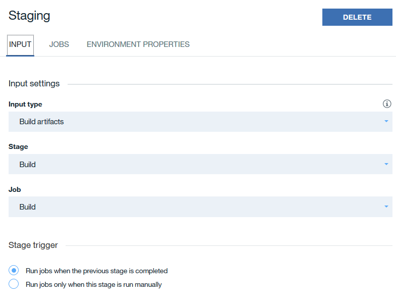
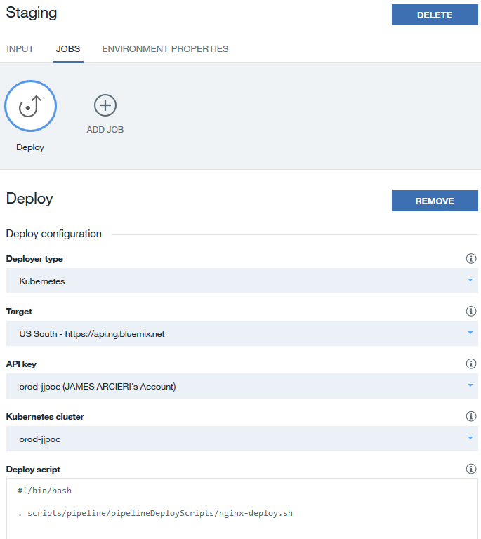

# Toolchain Introduction

This toolchain will enable your containers to automatically build and push to a registry as well as deploy to a Kubernetes cluster hosted on the IBM Cloud. This toolchain will be comprised of multiple pipelines, one for each major component of the cluster. Ideally there would be four different layers in build/deploy process:

  1. Build NGINX/PHP container images
  2. Drupal build layer
  3. Custom base code
  4. Brand/region specific code

Each of these layers could come from a different repository and could be built and deployed when code is pushed.

For the purpose of this P0C, we have one repo that contains all of our images and custom code. Our finished toolchain will appear as follows:

  

# Building the Toolchain

1. To get started, click on the "hamburger" menu at the top left of Bluemix and select **Dev Ops**.

  

2. Click on Toolchains on the left pane
3. Click Create Toolchain
4. Scroll down to Other Templates and select **Build Your Own Toolchain**

  

5. Name toolchain and click **Create**
6. Click on Add a Tool (img/addtool)
7. Click on **Git Repos and Issue Tracking**

  

8. Fill in details

  

  - Select Clone
  - Enter the URL to Dan's repo
  - Enter a Repository name (or not)
  - Make sure the **Track deployment of code changes** checkbox is checked. This will allow the pipeline to trigger automatically with code changes.
  - Click **Create Integration**
9. Add another tool
10. Select **Delivery Pipeline** (img/deliveryPipeline)
  - Name the pipeline **nginx**
  - Click **Create Integration**

11. Before moving on, we need to get an IBM Cloud API key. Click on **Manage** at the top right, hover over **Security** and select **IBM Cloud API keys**.

12. Click on **Create**, give your key a name and description, click Create.

13. Click *Show* and copy your API key. Make absolutely sure that you copied the key correctly because after you leave this page, you will not be able to see the key again.

14. Go back to your toolchain. You can get there by clicking on the menu at the top left, selecting **DevOps**, then selecting your toolchain from the list.

15. On the toolchain page, click on the Delivery Pipeline.

  

16. Click **Add Stage**

17. Make changes to **Input** tab.
  - Give stage a name
  - Ensure git URL and branch are correct
  - Ensure that **Run jobs whenever a change is pushed to Git** is selected. This will allow for the container images to build automatically.

    

18. Click on the **Jobs** tab. Click on **Add Job** and select **Build**.
  - Under *Builder Type* select **Container Registry**.
  - Under *API Key* see if your IBM Cloud API Key appears. If not, click on **Add an existing API Key** and enter the API key that you copied earlier.
  - For *IBM Cloud Container Registry namespace* enter **jjdojo**
  - In *Docker image name* enter **nginx**

  

  - In the *Build Script* section enter the following:
    ```bash
    #!/bin/bash
    echo "Calling the build script"
    . scripts/pipeline/buildImage.sh
    ```
  - Leave the rest as it is and click on **Save** at the bottom of the stage.

19. Once you are back on the pipeline page, click **Add Stage** again. Now we need to add our deploy stage.

20. Name the stage and make sure the input is coming from the previous build stage as seen below.

  

21. Next, click on the **Jobs** tab and click **Add job** and select **Deploy**.
  - For *Deployer Type* select **kubernetes**
  - Enter your API Key under *API Key*
  - Select the cluster that you would like to deploy to.
  - In the *Deploy Script* section, enter the following:

  ```bash
  #!/bin/bash
  . scripts/pipeline/deployScript.sh
  ```
  

  - When done, click on **Save**

22. We should now have two stages in our nginx pipeline. This pipeline will handle the building and deploying of the nginx container. We now need to add pipelines for our other containers. Click on the toolchain name at the top left of the page to take you back to the toolchain page.

  

23. Follow steps **14 - 22** to create pipelines for the other images while making sure to change the image names for the respective pipeline as well as making sure that the registry namespace and targeted cluster remains the same.

24. After repeating the steps, your toolchain should look like the following:

  

25. Next, we need to add the step to build the persistent volumes. Create one more pipeline and name it **Persistent Volumes**

26. Click on it to configure the pipeline and add a new stage.

27. Add a new **Deploy** job, for *Deployer Type* select **Kubernetes**, enter your API Key, and select your target cluster.

28. For the in the *Deploy Script* section, enter the following:
  ```bash
  #!/bin/bash
  kubectl apply -f scripts/kubernetes/persistent-volumes.yaml
  ```

  

29. When done, click **Save**. Click on the toolchain name at the top left to go back to the toolchain page.

30. Our toolchain is now configured and should look similar to the image below:

  

All that we have to do now is push a change to our repo to automatically kick off the pipeline.
